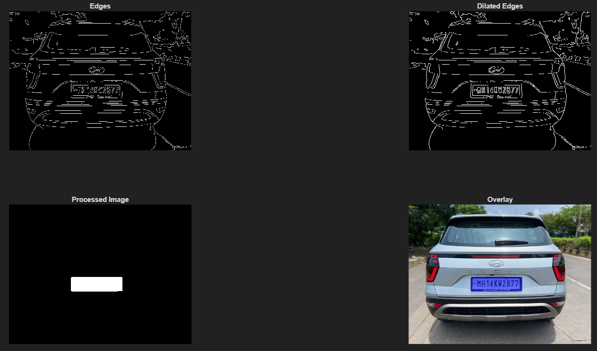
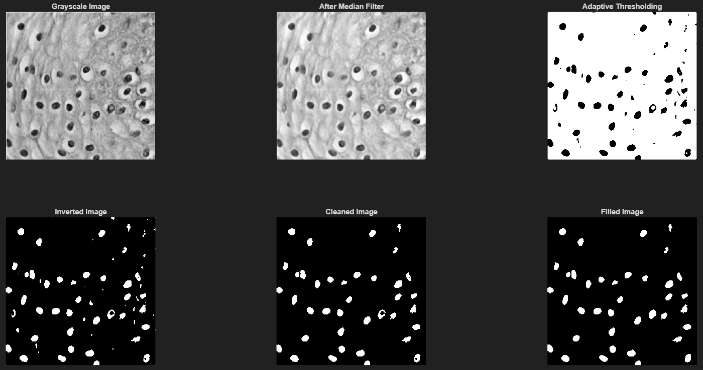
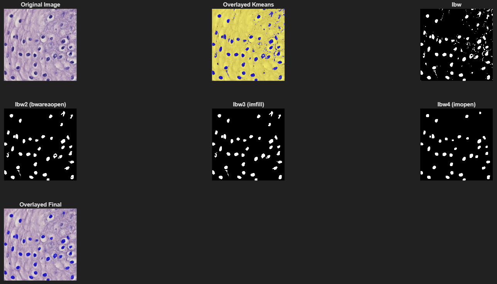
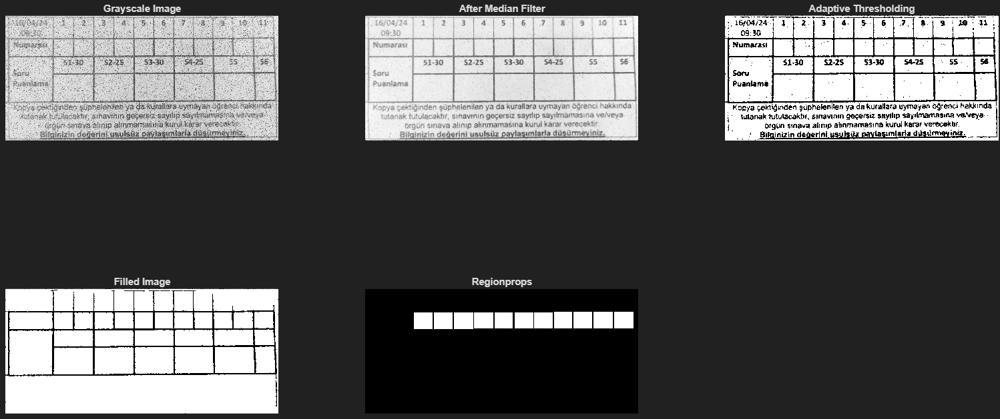
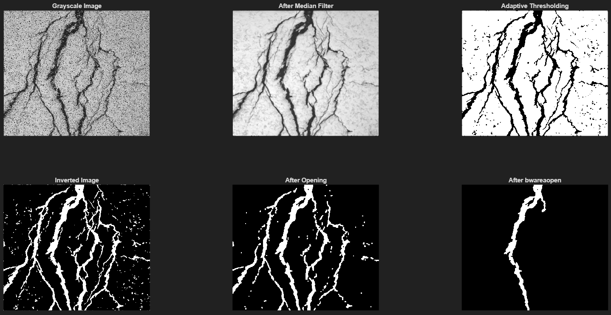

# Image Processing Applications

A collection of MATLAB-based image processing projects demonstrating computer vision techniques for object detection, segmentation, and automated analysis.

**Note:** These projects are educational implementations where image processing pipelines were manually tuned and optimized for specific input images. Parameters such as filter sizes, thresholds, and structuring elements were experimentally determined for each case.

## Projects

### Car Plate Detection
Automated license plate localization using Canny edge detection, morphological operations (dilation, opening), and region filtering.

**Approach:** Pipeline parameters (edge threshold, structuring element size) were manually tuned for the provided car image through experimental analysis.

---

### Cell Counting
Automated cell segmentation using two approaches:
- **Grayscale:** Adaptive thresholding with morphological cleaning
- **RGB:** K-means clustering (k=2) with morphological opening

**Approach:** Sensitivity values, area thresholds, and structuring element sizes were determined through iterative testing on the specific cell image.

---

### Exam Paper Number Detection
Detects handwritten numbers using adaptive thresholding, horizontal profile analysis, and region properties filtering based on location, area, and aspect ratio.

**Approach:** Uses horizontal projection to locate the number row region, then filters detected regions by centroid location (within number row), area constraints, and aspect ratio to isolate individual digits.

---

### Surface Crack Detection
Crack detection system for structural health monitoring. Calculates crack area and crack-to-surface ratio using adaptive thresholding and morphological operations.

**Approach:** Morphological opening parameters and area threshold were tuned specifically for the provided surface crack image.

**Output:** Crack area (pixels), total area (pixels), damage percentage

